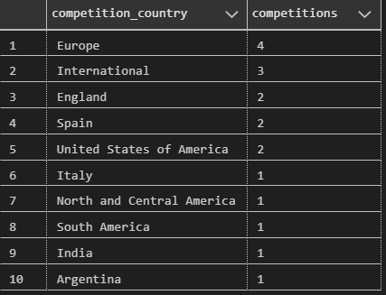
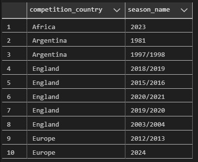
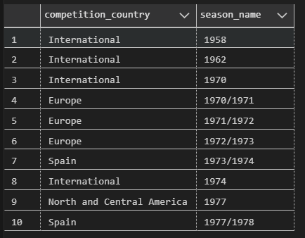
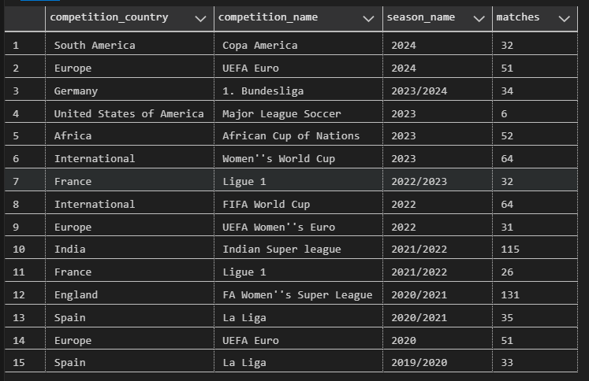

# statsbomb-loader
statsbomb loader

- Load data from https://github.com/statsbomb/open-data into postgres.

- WIP for Microsoft RAG challenge:
https://github.com/microsoft/RAG_Hack?tab=readme-ov-file#raghack-lets-build-rag-applications-together

- Official event: https://reactor.microsoft.com/es-es/reactor/events/23332/


## Install dependencies:

```bash
pip install -r requirements.txt
```

## Configure environment variables:

Fill in the .env file with your data. see .env.example file.

```bash
    # Base URL to access data on GitHub
BASE_URL=https://github.com/statsbomb/open-data/raw/master/data

REPO_OWNER=statsbomb
REPO_NAME=open-data
LOCAL_FOLDER=./data

# Configuración de la base de datos
DB_SERVER=your_server_name.database.windows.net
DB_NAME=your_database_name
DB_USER=your_username
DB_PASSWORD=your_password
```

Run the script:

```bash
python main.py
```

main.py includes comments.
Python code has different methods, each for a specific purpose:

Methods are:
- load_matches_data_into_db
- get_github_data_from_matches
- load_lineups_data
- load_events_data
- update_embeddings


see coments in the .py files.


```bash


    # 1) download all matches data from GitHub repository (statsbomb) to local folder
    get_github_data(repo_owner, repo_name, "matches", local_folder)

    # 2) store into the database the matches data
    load_matches_data_into_db(local_folder, server, database, username, password)

    # 3) get lineups and events data, based on the matches stored in the database. 
    #    this method only downloads the data from the repository into the local folder.
    #    it does not store the data into the database.
    get_github_data_from_matches(repo_owner, repo_name, "lineups", local_folder, server, database, username, password)
    # get_github_data_from_matches(repo_owner, repo_name, "events", local_folder, server, database, username, password)


    # 4) load downloadded data into PostgreSQL from local folder
    load_lineups_data(server, database, username, password, local_folder)
    load_events_data(server, database, username, password, local_folder)

    # For azure_open_ai or azure_local_ai
    model = "azure_local_ai"  # azure_open_ai,
    # azure_local_ai (see azure_open_ai documentation, only supported in specific regions and Memory Optimized, E4ds_v5, 4 vCores, 32 GiB RAM, 128 GiB storage)

    # Update embeddings for different tables
    update_embeddings(server, database, username, password, model, "events", 10, -1)
   
```

## Usage of vector databases in SQL PaaS:

- feature: https://github.com/Azure-Samples/azure-sql-db-vector-search
- requirements: https://github.com/Azure-Samples/azure-sql-db-vector-search?tab=readme-ov-file#prerequisites
- sign up: https://aka.ms/azuresql-vector-eap


## Data distribution

This script is in [tables_data_distribution](.\postgres\tables_data_distribution.sql)


### competitions by country/region
```sql
select competition_country, count(distinct season_name) seasons
from matches m
group by competition_country
order by seasons DESC limit 10;
```


### competitions by country/region
```sql
select competition_country, count(distinct competition_name) competitions
from matches m
group by competition_country
order by competitions DESC limit 10;
```


### seasons by country/region
```sql
select distinct competition_country, season_name
from matches m
order by competition_country limit 10;
```



### seasons by country/region
```sql
select distinct competition_country, season_name
from matches m
order by season_name limit 10;
```



### recent season by country/region
```sql
select competition_country, competition_name, season_name, count(*) matches
group by competition_country, competition_name, season_name
order by season_name DESC limit 15;
```



